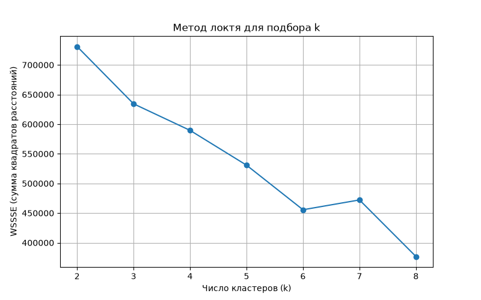

# Open Food Facts Clustering — Lab 5

Кластеризация продуктов питания на PySpark (алгоритм k-means) по данным Open Food Facts.

## Задача
Лабораторная работа №2, курс «Инфраструктура больших данных», ИТМО, весна 2026.
Цель — получить навыки разработки и настройки Spark-приложения.

## Стек
- PySpark 3.5.3
- Java 17 (Temurin)
- Hadoop winutils 3.3.6 (для локального запуска Spark на Windows)


## Данные
Open Food Facts CSV export: https://static.openfoodfacts.org/data/en.openfoodfacts.org.products.csv.gz
(~1.27 ГБ, ~4.5 млн строк)

## Предобработка
- Отобраны числовые признаки состава продукта: `energy-kcal_100g`, `fat_100g`, `saturated-fat_100g`, `carbohydrates_100g`, `sugars_100g`, `proteins_100g`, `salt_100g`, `fiber_100g`
- Удалены строки с пропусками — из ~4.5 млн строк осталось ~894k
- Взята случайная выборка ~100k строк (адекватный размер для локального обучения)
- Признаки стандартизированы (`StandardScaler`)

## Подбор числа кластеров
Использован метод локтя (elbow method) — перебор k от 2 до 8 с оценкой по WSSSE (сумма квадратов внутрикластерных расстояний). Автоматически выбрано **k=6**.



## Результат
- Silhouette score: **0.375**
- Распределение по кластерам:

| Кластер | Размер |
|---|---|
| 0 | 50946 |
| 1 | 2 |
| 2 | 31352 |
| 3 | 2152 |
| 4 | 15808 |
| 5 | 15 |

Кластеры 1 и 5 — крайне малочисленные, соответствуют выбросам в данных (аномальные значения состава, распространённая проблема качества данных в Open Food Facts).

## Запуск
```powershell
.\.venv\Scripts\Activate.ps1
.\setup_env.ps1
python main.py          # проверка Spark
python clustering.py    # обучение модели кластеризации
```

## Известные нюансы Windows-окружения
- Проект должен быть доступен по пути без пробелов/кириллицы (используется junction на `C:\lab5`) — иначе PySpark ломается при сборке classpath
- Требуется `winutils.exe` + `hadoop.dll` в `HADOOP_HOME\bin`
- Стандартная заглушка Windows `python.exe` в `WindowsApps` может конфликтовать с venv — при проблемах убрать её из PATH (см. `setup_env.ps1`)